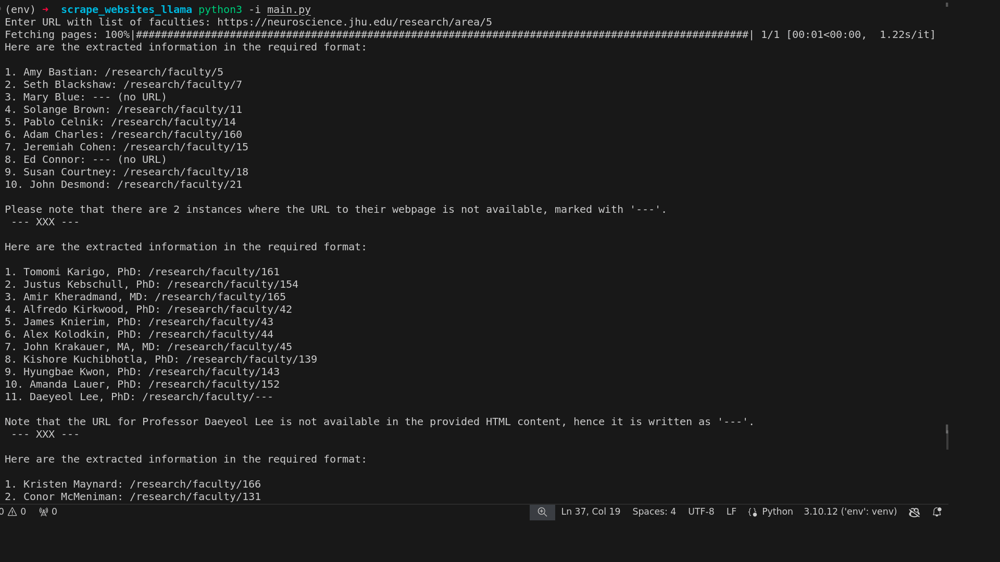

# Scraping reasearchers' info from any webpage using LLaMA3(via Ollama) and Langchain
Given a URL like [this](https://neuroscience.jhu.edu/research/faculty), makes a CSV containing professors' info.

Procedure the code follows:
1. In chunks, the input URL content is proceessed by LLM to extract professor name, URL to individual web page
2. Make a JSON from the extracted text
3. Make a request to individual webpages, and obtain rest of the info

# Demo

# Problems
 The quality of the final output, depends on LLM output at intermediate stages. For example, in first stage, it doesn't extract all the professors. To tackle this, you can reduce the chunk size, but it results in more running time. In third stage, the LLM sometimes doesn't follow the specified output format. A possible way to circumvent it, is passed the output again into LLM. But again, it will result in long running time.

# Usage
1. Install requirements from requirements.txt
`pip install requirements.txt`

2. Have Ollama installed with LLaMA3 model pulled

3. Run main.py and paste the input URL